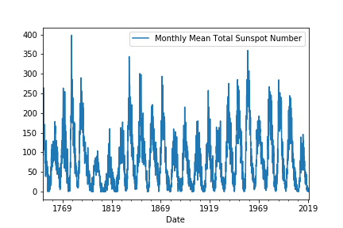
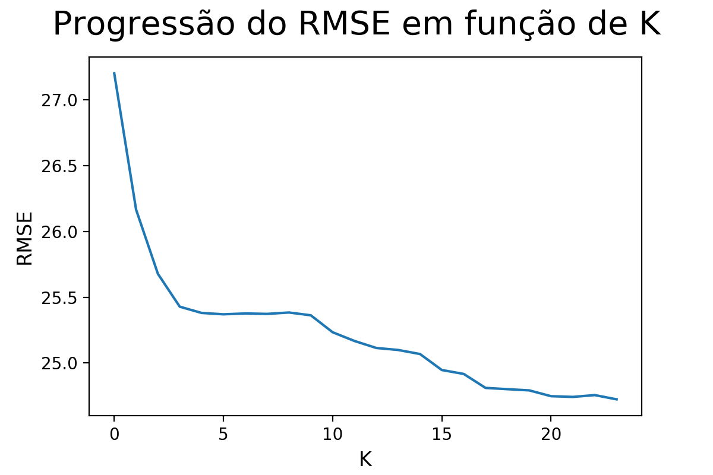
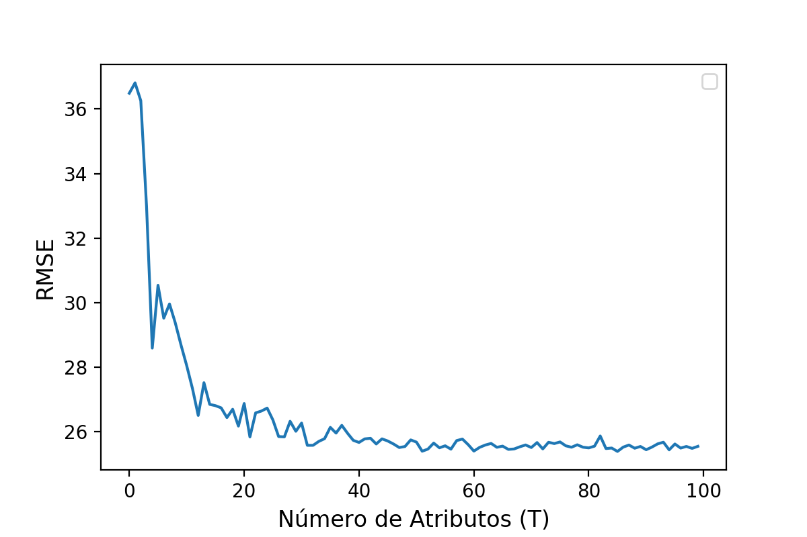
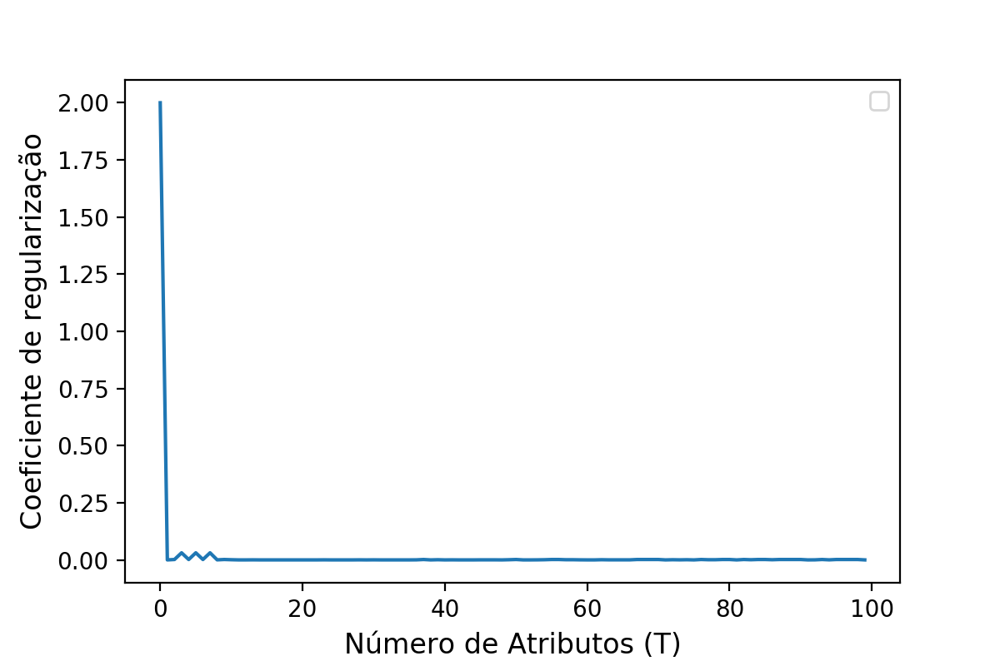

# Sunsposts_Forecasting
Project developed in the post graduate subject IA048-Machine Learning at FEEC,UNICAMP. Time series forecasiting using Autoregressive model and ELM

# Dataset
The dataset contains the month values of sunspots from 1749 to 2019, containing in total 3252 samples. The figure below shows the complete series.

The last 10 years (2010-2019) were used in the test set.

# AR model
In order to find the best past value to use in our regression AR(K), for each delay considered
the RMSE value was stored. Also, for this, a 5-fold cross validation was used to improve the generalization
of the model.
Below is shown the RMSE progression in terms of the delays considered.

As can be seen, the hyperparameter K = 24 gives the best RMSE value, and this will be set on the model to evaluate on the test set.

RMSE on test set: 16.249

# ELM model - Huang, G.-B., Zhu, Q.-Y., e Siew, C.-K. (2006). Extreme learning machine: theory and applications. Neurocomputing, 70, 489–501

For this problems, the value of K = 8(delay value) was considered, but now, the number of neurons in the ELM layer between [1,100] was evaluated, also, a Ridge regression was applied, and its coeficient, alpha, was also evaluated.
The values of our series were weighted with a uniform distribution between 0,1 to fit in the linear part of Tanh function. This transformation resulted in a new dataset, now, with the number of attributes equals to T, value that will be analyzed below. After this, a Ridge regression was applied in the transformed dataset

# Best number of neurons in ELM layer in function of RMSE T = 98

# Best value of the alpha regularization coeficient in function of RMSE alpha = 2^-5

RMSE on test set: 17.138
